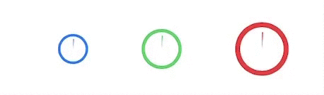
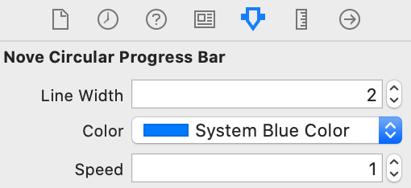

# NoveCircularProgressBar

[](https://cocoapods.org/pods/NoveCircularProgressBar) [](https://cocoapods.org/pods/NoveCircularProgressBar) [](https://cocoapods.org/pods/NoveCircularProgressBar)

An animated circular progress bar for your iOS projects in Swift.

## Features

<p align="center">
  
</p>

- [x] Fully animated progress bar.
- [x] Can be used and customized in Interface Builder.
- [x] Customize color, animation duration and size.
- [x] Customize border size for bigger or smaller display.
- [x] Is unit tested.


## Requirements

- iOS 9.0+


## Installation

NoveCircularProgressBar uses [CocoaPods](http://cocoapods.org). It is a dependency manager for Cocoa projects.

To integrate **NoveCircularProgressBar** into your Xcode project using CocoaPods, specify it in your `Podfile`:

```ruby
source 'https://github.com/CocoaPods/Specs.git'
use_frameworks!

pod 'NoveCircularProgressBar', '~> 1.0'
```

Then, run the following command:

```bash
$ pod install
```


## Usage

### Creating a new instance

In Interface Builder, you can add a `UIView` to your interface, and set the custom class to `NoveCircularProgressBar`:

<p align="center">
  
</p>

You can also create the progress bar programmatically. To do so, simply import the module and use the following initializer:

```swift
import NoveCircularProgressBar

let progressBar = NoveCircularProgressBar(frame: CGRect(x: 0, y: 0, width: 24, height:  24))
```

Then, add the progress bar to its parent:

```swift
parentView.addSubview(progressBar)
```

### Configuration

The progress bar is composed of a static border and an animated progress bar.

<p align="center">
  
</p>


`NoveCircularProgressBar` is configurable to match your app requirements. You can adjust the following settings:

* `color` will change the progress bar color and its border color.
* `speed` represents the duration of the animation for the progress bar to go from 0.0 to 1.0.
* `lineWidth` represents the border thickness and the space between the border and the progress bar.

You can set those properties in the Interface Builder:

<p align="center">
  
</p>

Or you can set them programmatically once your bar is instanciated:

```swift
progressBar.lineWidth = 2.0
progressBar.color = .systemBlue
progressBar.speed = 1.0
```

### Percentage update

Once your progress bar is created — and configured — you can update the displayed percentage by calling:

```swift
progressBar.updateProgress(to: percentage, animated: true)
```

With the following parameters

* `to` is the new percentage to display (between 0.0 and 1.0),
* `animated` tells the component to play an animation or to jump to its destination.

## Credits

Steve Gigou ([Website](https://steve.gigou.fr), [Twitter](https://twitter.com/stevegigou))


## License

NoveCircularProgressBar is available under the MIT license. See the LICENSE file for more informations.
